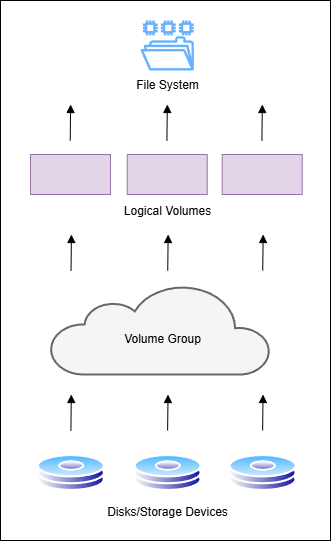

# Chapter 15: Managing Advanced Storage

**LVM (Logical Volume Manager)**
- partitions are not flexible, which led to the creations of LVM
- with LVM, you can dynamically grow a partition that is running out of disk space

**Storage devices** need to be flagged as physical volumes to be used in an LVM, After that, the storage device can be added to a **volume group**. 

**Volume group**
- abstraction of all available storage
  - abstraction means that the volume group can be resized and is not fixed
  - if you're running out of space on a logical volume, you tae available disk space automatically from the volume group
  - if there's no disk space in the volume group, add a physical volume

**Logical volumes** are on top of volume groups.
- they get space from the volume groups
- file systems are created on here
- file system must support resizing for it to occur

**LVM Advantages**:
- flexible for managing storage
- **snapshots**
  - keep the current state of a logical volume
  - can be used to revert to a previous situation or make a backup of the file system on the logical volume
  - created by copying the LV metadata of the current state of files
  - tracks changed when data changes on the original volume
  - use cases:
    - backups
    - creating test env
    - rollback system modifications
    - consistent file system backups
- option to easily replace failing hardware
  - data can be moved within the volume group and the failing disk can then be removed from the volume group
  - a new disk can be added dynamically, without any downtime

To create LVM logical volumes, you need 3 layers:
1. **Physical volumes (pv)**
2. **Volume group (vg)**
3. **Logical volume (lv)**

** Before creating a PV, you need to make a partition and change the partition type to **8e00** or **lvm** on fdisk.

`pvcreate /dev/xxx` creates a physical volume on the specified partition

`pvs` lists the physical volumes on the system You can use `pvdisplay` for more details.

You need to assign physical volumes to a volume group. 

`vgcreate vgdata /dev/disk-name` - one step for adding a whole disk to a volume group

**physical extent size**
- the size of the building blocks used to create logical volumes
- logical volumes have a size that is a multiple of the physical extent size
- default size is 4MiB and max size is 128Mib

`vgcreate -s` specify the size of the physical extent

** When creating a logical volume, you need to specify the volume name ans size.

**device mapper (dm)**
- generic interface that the linux kernel uses to address storage devices
- creates symbolic links to make devices easier to access

`pvcreate` creates physical volume.

`pvs ` shows the summary of available physical volumes.

`pvdisplay` shows the list of physical volumes and their properties.

`pvremove` removes the physical volume signature from a block device. 

`vgcreate` creates volume groups.

`vgs` shows summary of available volume groups.

`vgdisplay` shows detailed list of volume groups and their properties. 

`vgremove` removes a volume group.

`lvcreate` creates a logical volume.

`lvs` shows summary of available logical volumes.

`lvdisplay` shows detailed list of logical volumes and their properties.

`lvremove` removes a logical volume.

XFS resizing - XFS file systems can only be *increased*. 

Ext4 resizing - Ext4 resizing can be *increased or decreased*. To decrease it, it must be offline, which means it has to be **unmounted** before it can be resized. 

`vgextend` adds storage (froma  physical volume) to a volume group. *Ex:* `vgextends <volume-group> <pv-to-add>`.

`vgreduce` 
- removes storage from a volume group
- removes physical volumes (pv) from a volume group (vg)
- *Ex:* `vgreduce <volume-group> <physical-volume>`

`lvextend -r` extends the logical volume's size. **-r** option allows the file system to be extended at the same time. It's recommended to use it for less errors.

logical extent
- building blocks that give LVM flexibility
- think of logical volumes as a lego structure and each logical extent is a single lego block
- fixed-size storage unit
  - size is set when you create a volume group 
- LVM move sthese extents around like moving lego blocks
- enables snapshots
- makes it easy to add/remove blocks between different storage containers

`pvmove`
- move extents to other volumes
- move space to other volumes
- transfers data from one PV to another PV
- *Ex:* `pvmove <source> <destination>`

**Stratis**
- advanced storage solution
- volume-managing file system
- offers these features:
  - thin provisioning
  - snapshots
  - cache tier
  - programmatic API
  - monitoring and repair
- only XFS file system is used
- a startis pool is similar to an LVM volume group

 

### Do you already know? Questions

1. Logical volumes, volume groups and physical volumes are standard components in an LVM setup.

2. Volume resizing, hot replacement of failing disk and snapshots are LVM features.

3. The partition type **8e00** is required on a GPT partition to mark it as an LVM partition. 

4. `lvcreate -n lvdata -l 50%FREE vgdata` gives lvdata 50% of available space. The **-l** option allows you to specify the space to be allocated in logical extents, instead of using **-L**, which only specifies the exact size (4MiB).

5. `pvs` and `pvdisplay` shows overviews of current physical volumes. 

6. XFS files systems can only be *increased*, not decreased. 

7. File system shrinking is not required for the removal of a physical volume. 

8. Use `xfs_growfs` to grow the file system if you did not extend it when you extended the logical volume with the **-r** option.

9. 527MiB is required in a Stratis file system for metadata storage.

10. To mount a Startis file system in /etc/fstab, you need to add `UUID=xxx /stratis-mnt-point xfs defaults,x-systemd.requires=stratisd.service 0 0`.

### Review Questions

1. The **8e00** partition type is used on a GUID partition that needs to be used in lvm.

2. `vgcreate vgroup -s 4MiB /dev/sdb3` creates a volume group with the name *vgroup*, that contains the device */dev/sdb3* and sets a physical extent size of *4MiB* with the **-s** option. 

3. `pvs` shows a short summary of the physical volumes on the system and the volume group they belong to. 

4. To add an entire hard disk to the volume group *vgroup*, you can extend it using `vgextend vgroup /dev/sdd` where "sdd" is the name of the hard disk. 

5. `lvcreate -L 6MiB -n lvvol1 vgname` creates a logical volume names *lvvol1* with a size of 6MiB.

6. `lvextend -r -L +100MB /dev/vgname/lvvol1` adds 100mb to the logical volume *lvvol1*. 

7. The 2 commands to remove a physical volume from a volume group are:
  - `pvmove` to move the used extents to the remaining PVs (move existing data)
  - `vgreduce` to remove the PV from the VG

8. To mount a Stratis volume in /etc/fstab, add the line 
`UUID=xxx /stratis-mnt-point xfs defaults,x-systemd.requires=stratisd.service 0 0`.

9. `stratis pool create mypool /dev/sdd` creates a strtis pool that is based on the block device /dev/sdd.

10. You can't change Stratis to have an Ext4 file system. It comes with an XFS file system by default and cannot be changed.

