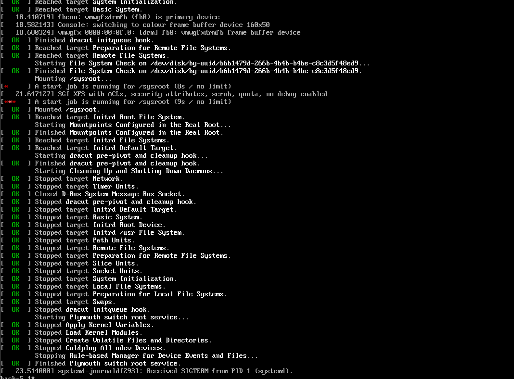
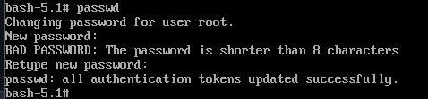
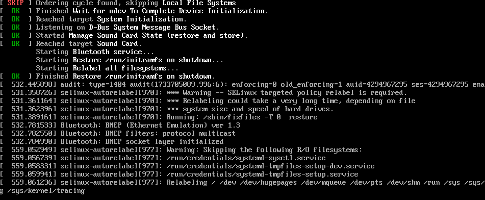
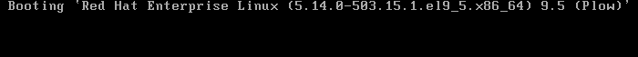
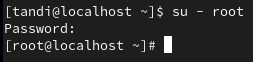
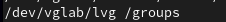
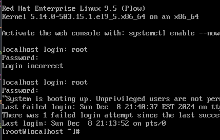
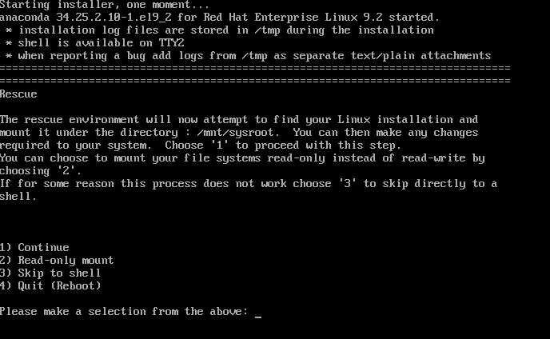

# Lab 18.1

Lab on troubleshooting the boot procedure.

#### 1. Restart your server and change the root password from the appropriate troubleshooting mode.

**1.1. Press `e` when the GRUB 2 boot menu is shown on system boot.**

**1.2. Add `init=/bin/bash` to the line in the GRUB 2 menu to the line that loads the kernel, save and boot with ctrl + x.**




**1.3. Ensure there is read/write access to the root file system.**

```bash 
mount -o remount,rw /
```


**1.4. Change the root password**

```bash 
passwd
```




**1.5. Ensure that the SELinux security labels are set up correctly to avoid errors in /etc/shadow.**

```bash 
touch /.autorelabel
```


**1.6. Change PID 1 from */bin/bash* to *Systemd***

```bash 
exec /usr/lib/systemd/systemd
```




**1.7. Reboot**



Verify that the root password has changed.




#### 2. In /etc/fstab, change one of the device names so that on the next reboot the file system on it cannot be mounted. Restart and fix the issue that you encounter.

```bash 
vim /etc/fstab
```

I changed the device name and rebooted.



It rebooted into emergency mode and I entered the root credentials.



I changed the /etc/ftsab back to what it was before, reloaded the daemon, and remounted the file. 

```bash 
vim /etc/fstab

systemctl daemon-reload

mount -a

reboot
```

I rebooted and the system went back to the normal graphical interface.


#### 3. Use a rescue disk to bring your server up in full troubleshooting mode from the rescue disk.

**1.1. Press `ESC` during the boot process to open the Boot Menu. You have to be quick otherwise it goes away.**

**1.2. Select the CD drive.**

**1.3. Navigate to troubleshooting mode.**




#### 3. Re-create the initramfs.

Run the below command to recreate the *initramfs*.

```bash 
dracut --force
```


---