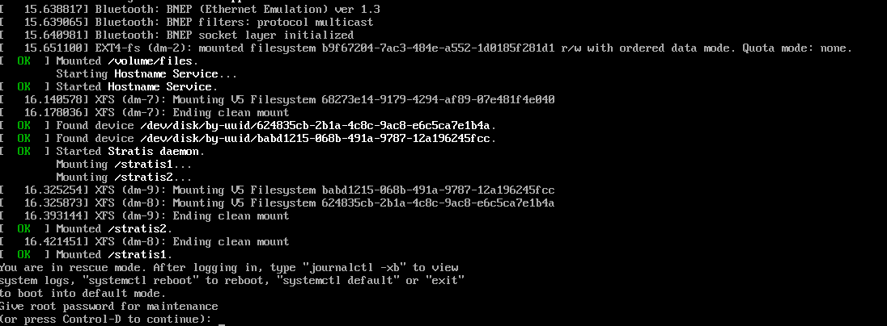
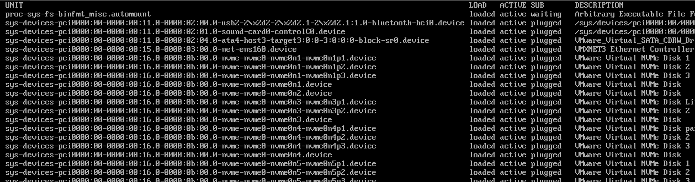
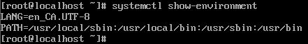
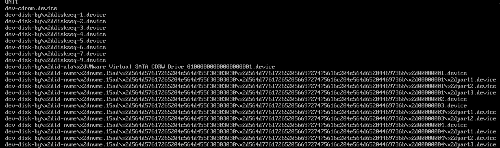

# Exploring troubleshooting targets
## Exercise 18-1


### Step 1: Restart the system.

When the GRUB menu shows, select the first option and type `e` to edit.


### Step 2: Edit the line that starts the kernel.

The line that begins with `linux $(root)/vmliuz ...` is the line that loads the kernel. We can add boot options here. 

Type `systemd.unit=rescue.target` at the end of the line and remove the `quiet` and `rhgb` options.

Type **crtl + x** to save and apply the changes.




### Step 3: Show all unit files currently loaded and then show the current shell environment variables.

Show unit files: 

```bash
systemctl list-units
```



Show current shell env variables:

```bash
systemctl list-units
```




### Step 4: Reboot and edi the same line as before with a different target.

Repeat Step 1 and 2, except add `systemd.unit=emergency.target` to the end of the same line.

Type **crtl + x** to save and apply the changes.


### Step 5: Show all unit files currently loaded.

```bash
systemctl list-units
```



Notice how much less unit files are displayed in this target.

---